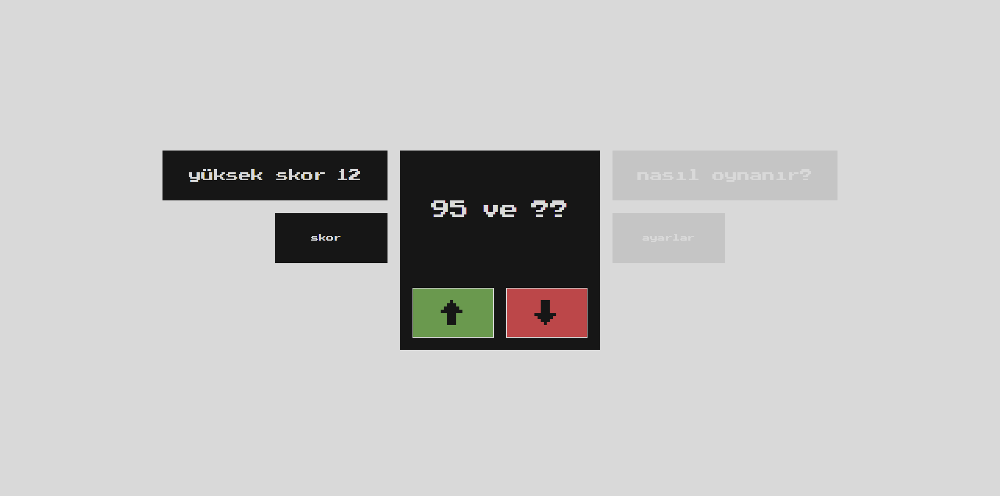
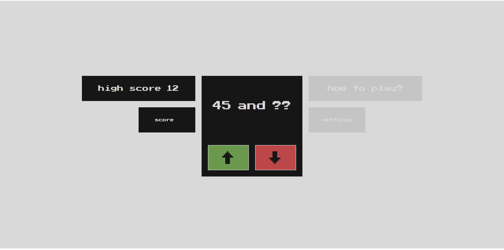

### Guess - Game
####Nedir? Nasıl oynanır? - TR
>Dosyaları indirdikten sonra "startGame.html" sayfasına tıklayıp direkt oyunu başlatabilirsiniz.
- Oyun tahmin ve şansınıza bağlı bir oyundur.
- Oyunu başlattığınız zaman ilk sayı oluşturulur solda gözükür ikinci sayı "??" ile gizlenmiştir.
- Sayılar sadece 0-99 arası bir değer alır.
- Sizin amacınız ikinci sayının ilk sayıdan daha mı büyük yoksa daha mı küçük olduğunu aşağı .veya yukarı oklarına tıklayıp tahmin etmektir
- Kazandığınızda 1 skor eklenir.
- Eşitlik durumu çok düşük olduğu için kazanmış sayılırsınız ve ekstra 10 skor eklenir.

---
####What is it? How to play? - EN
>After downloading the files, you can directly start the game by clicking on the "startGame.html" page.
- The game is a guessing game and relies on your luck.
- When you start the game, the first number is generated and shown on the left, and the second number is hidden with "??".
- The numbers only take a value between 0-99.
- Your goal is to guess whether the second number is greater or less than the first number by clicking the up or down arrows.
- When you win, 1 point is added to your score.
- The equality situation is very low, so you are considered a winner and an extra 10 points are added to your score.
